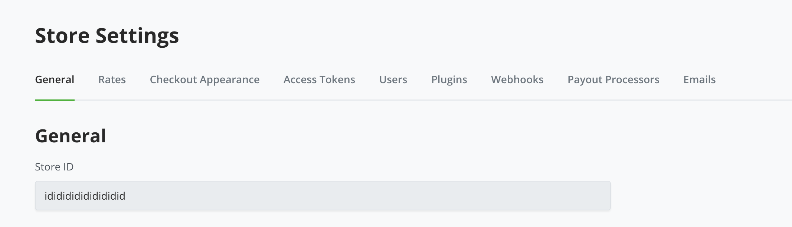
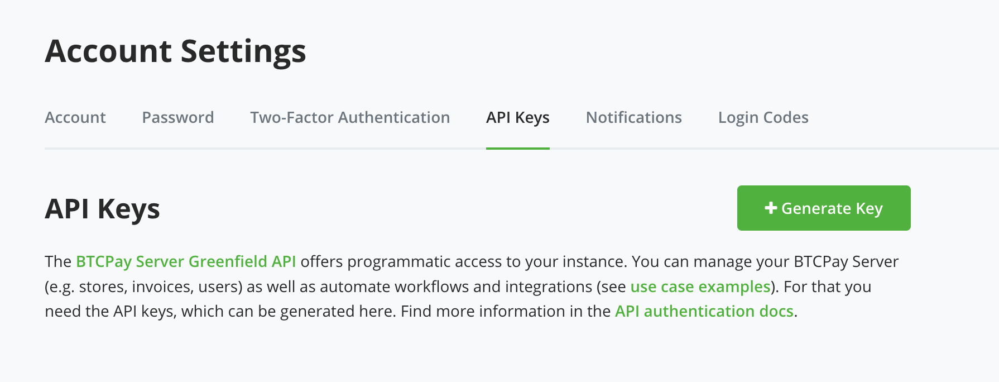
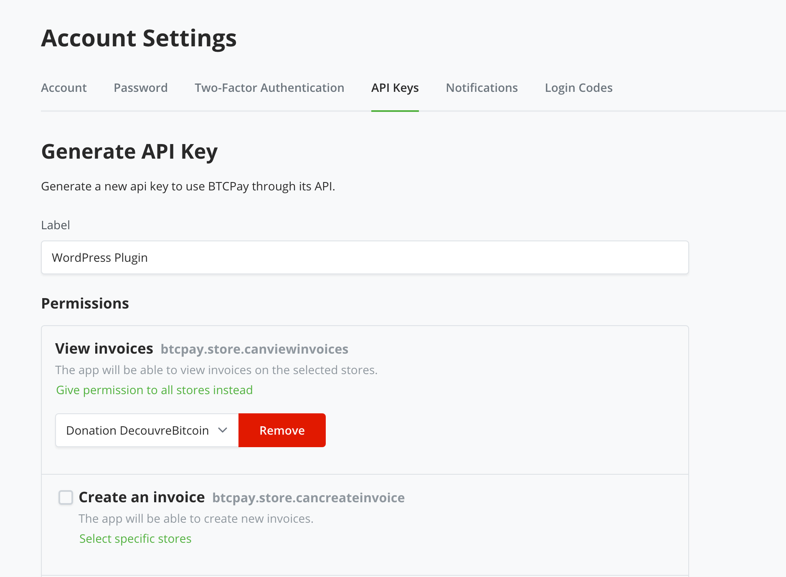
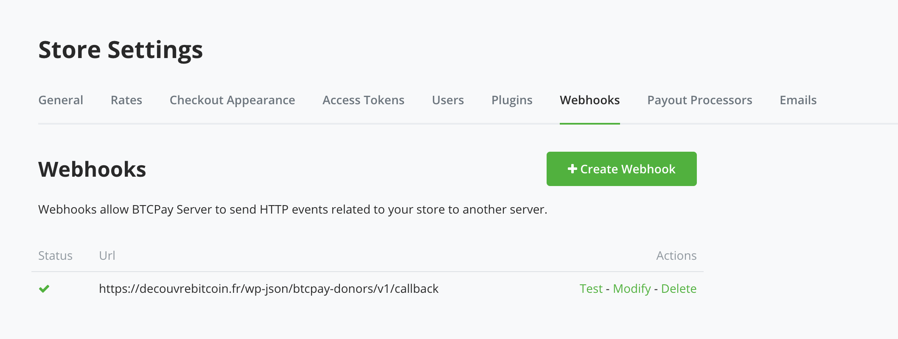
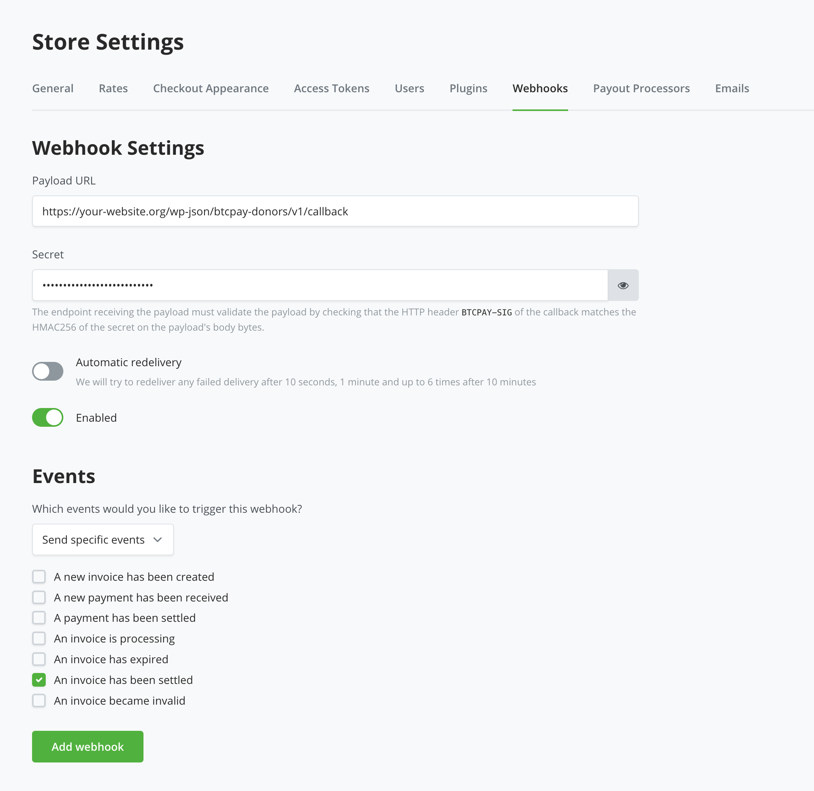
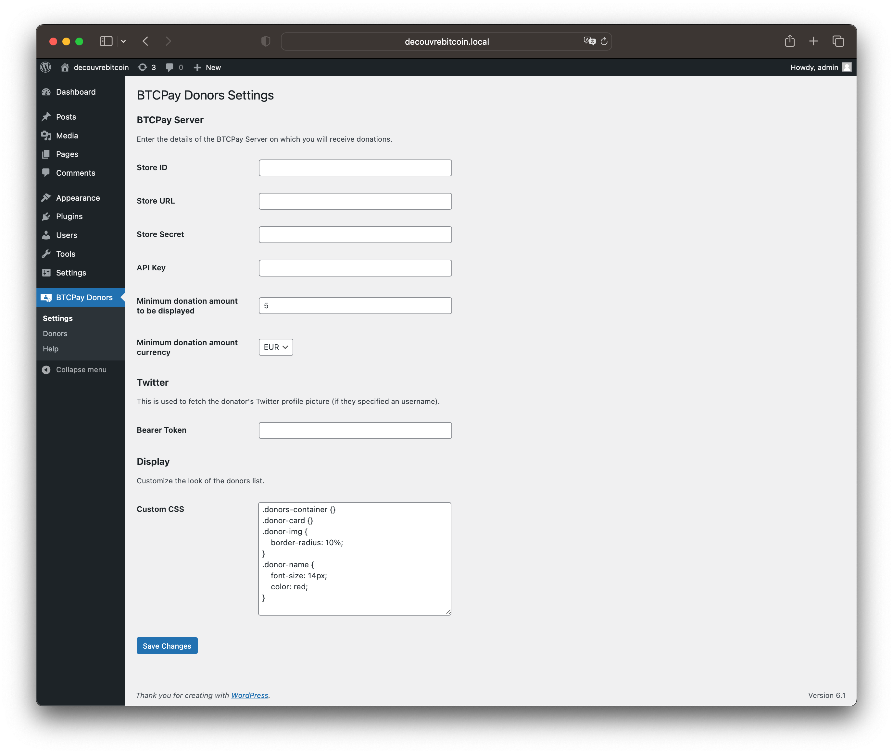
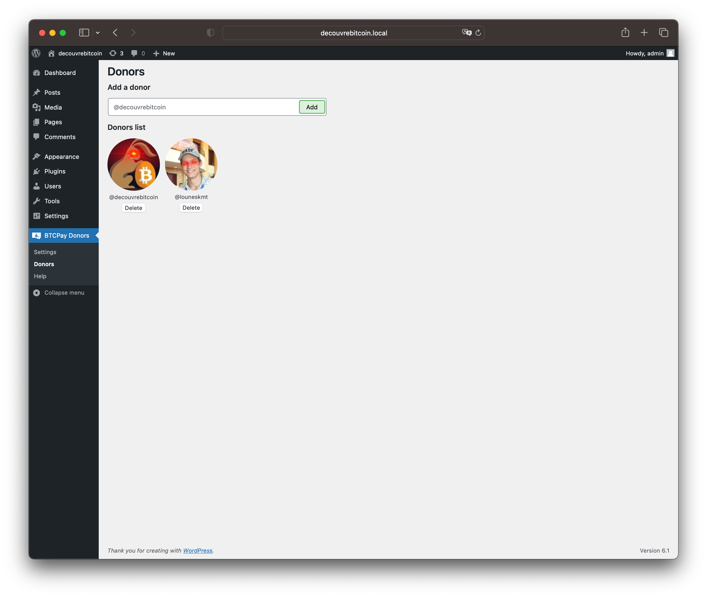
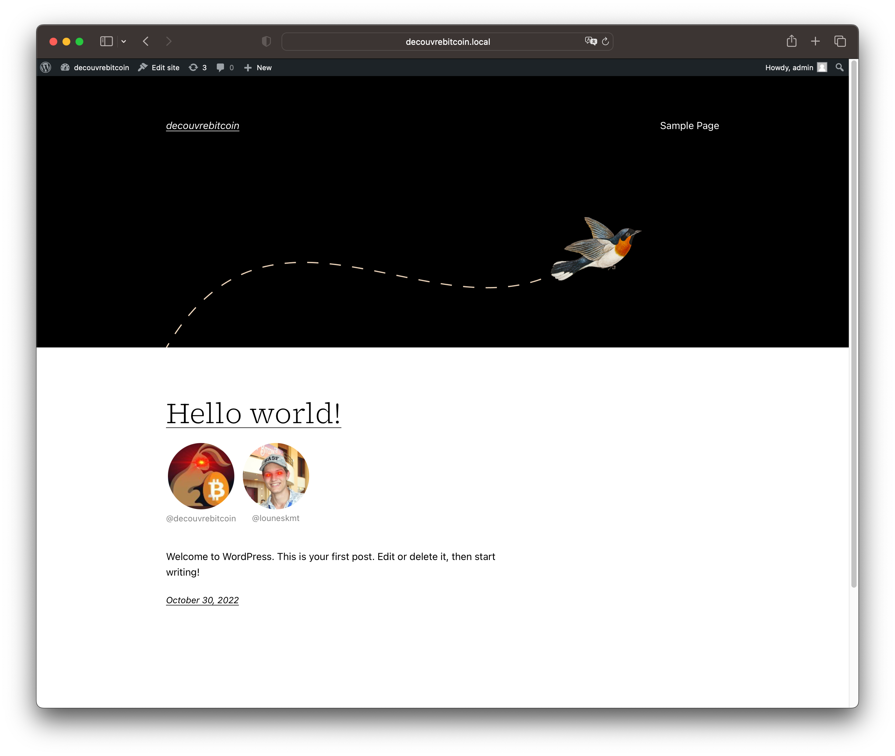

# BTCPay Donors - Wordpress plugin

Display your BTCPay Donors directly on your Wordpress website. Donors can add their Twitter username to the donation description in order for their profile picture to get fetched and displayed in the donors list.

Use the shortcode [btcpay_donors_shortcode_donors] to display the list.

## Configuration

### BTCPay Server

#### Get your Store ID

Go to your BTCPay Server Store's settings and copy the `Store ID` to the plugin settings page.

#### Get your API Key

Go to your BTCPay Server Account's settings, and click the `API Keys` tab.

Generate a new key and click `Select specific stores` for `View invoices`. Select your store, then generate the key with the submit button.

Copy the generated key to `API Key` in the plugin settings page.

#### Setup the webhook

Go to your BTCPay Server Store's settings, and click the `Webhooks` tab.

Create a new webhook with URL `https://your-website.org/wp-json/btcpay-donors/v1/callback`, triggered by the specific event `an invoice has been settled`. Copy the secret to `Store Secret` in the plugin settings page.

## Screenshots

